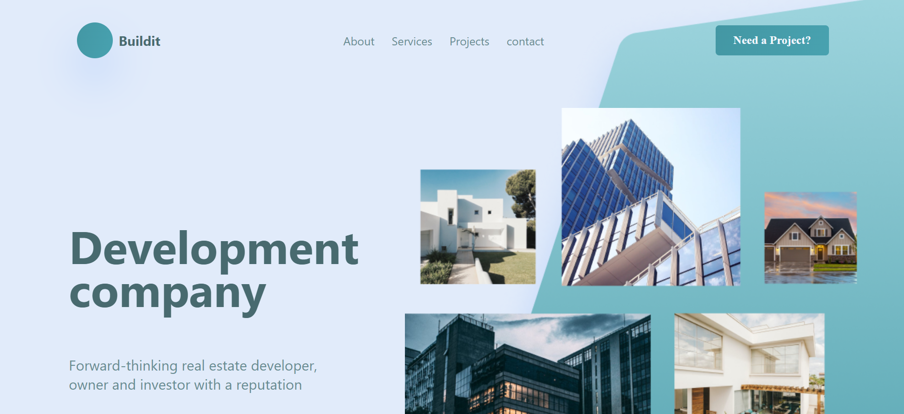

This is a [Next.js](https://nextjs.org/) project bootstrapped with [`create-next-app`](https://github.com/vercel/next.js/tree/canary/packages/create-next-app).

# the-gym-first-nextproject

## Welcome! 👋

This is a solution to the Gym Traning. The Gym challenge help us to improve our coding skills by building realistic projects.
In this exercise, we will use nextjs and css, Only clone the "Home" and "About" pages. Create the other pages as well, so that the menu is complete. But don't add any content.

## Content

- [the-gym-first-nextproject](#the-gym-first-nextproject)
- [Welcome! 👋](#welcome)
- [The challenge](#the-challenge)
- [Screenshot](#screenshot)
- [Links](#links)
- [My process](#my-process)
- [Author](#author)
- [Connect Us:](#connect-us)

### The challenge

The-gym-stripe-clone
Users should be able to:

- Try to implement the design below, using only Nextjs and css,
- When you start the project, immediately create a "development" branch where you will do all your coding,
- When you are finished, create one large pull request (dev > main), which will then be reviewed by the code reviewer of your gym,
- Buildit-page link: [Buildit](<https://www.figma.com/file/P69doL9MoLiayAEAgWPb79/Buildit---Website-Building-and-Development-(Community)?node-id=1%3A22>)

### Screenshot

### Links

- Live Site URL Open [buildit]() with your browser to see the result.

## My process

- HTML
- Tailwind
- Mobile-first workflow

## Author

- Twitter - [@ibrahim_Bagalwa](https://twitter.com/ibrahim_Bagalwa)
- LinkedIn - [ibrahim-bagalwa](https://www.linkedin.com/in/IbrahimBagalwa)

## Connect Us:

   

---

